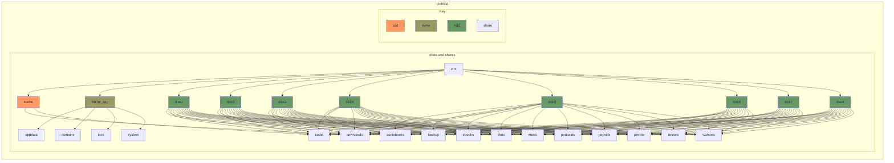

|    Share   |                         Usage                        |
|------------|------------------------------------------------------|
| appdata    | Docker persistent stotrage                           |
| audiobooks | CD rips                                              |
| backup     | a few temp backup jobs dump their output here        |
| code       | a few small coding projects                          |
| domains    | VM images                                            |
| downloads  | temporary home for downloads                         |
| ebooks     | purchased audiobooks                                 |
| films      | DVD/Bluray rips                                      |
| isos       | ISO images used for VM's                             |
| music      | CD rips                                              |
| podcasts   | a few favourite podcasts live here for easy locating |
| popvids    | DVD rips                                             |
| private    | personal stuff                                       |
| restore    | temporary home for restroing backups                 |
| system     | Docker images, containers, volumes                   |
| tvshows    | DVD/Bluray rips                                      |
